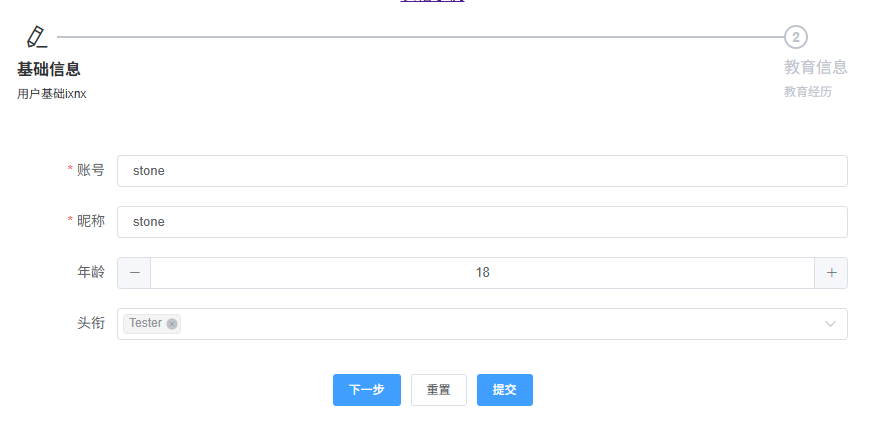
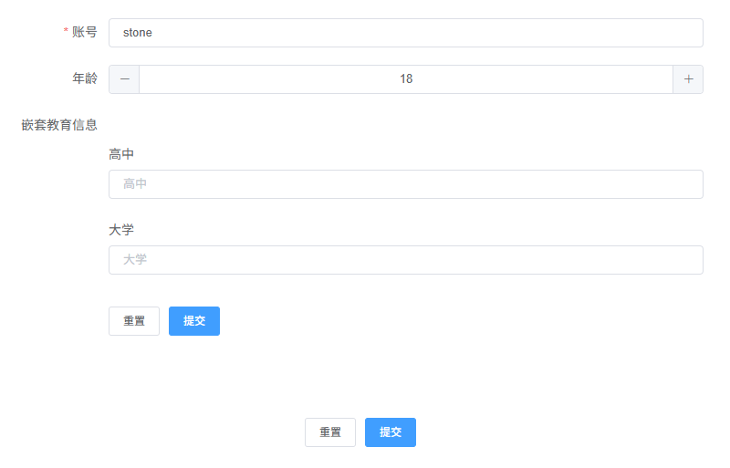
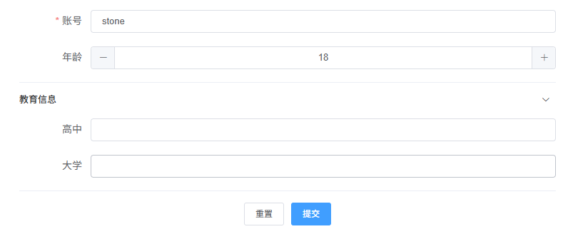

<!--
 * @Author: lianglei stone.ll@qq.com
 * @Date: 2025-04-10 09:02:36
 * @LastEditors: lianglei stone.ll@qq.com
 * @LastEditTime: 2025-04-14 17:08:05
 * @FilePath: \ll-form-table\docs\form.md
 * @Description: 表单使用文档
-->
# LlForm

- [1．概述](#1﹣概述)
- [2．快速上手](#2﹣快速上手) 
  - [2.1 引入element-ui](#21﹣引入element-ui) 
  - [2.2 完整引入](#22﹣完整引入) 
  - [2.3按需引入](#23﹣按需引入) 
- [3．注册ll-form](#3﹣注册ll-form) 
- [4．用法介绍](#4﹣用法介绍) 
  - [4.1，通过模板定义表单项](#41﹣通过模板定义表单项)
  - [4.2．通过formItems配置对象定义表单](#42﹣通过formItems配置对象定义表单) 
  - [4.3．混合定义表单](#43﹣混合定义表单) 
- [5．表单详解](#5﹣表单详解) 
  - [5.1．如何通过formItems配置表单项](#51﹣如何通过formItems配置表单项) 
    - [5.1.1. formItems的数据结构说明](#511-formItems的数据结构说明) 
    - [5.1.2．表单项render渲染函数](#512﹣表单项render渲染函数) 
      - [5.1.2.1．通过labelRender渲染函数自定义表单项1abel](#5121﹣通过1abelRender渲染函数自定义表单项label) 
    - [5.1.3．注册自定义的UI渲染类型](#513﹣注册自定义的UI渲染类型) 
      - [5.1.3.1. addUIType](#5131-addUIType) 
      - [5.1.3.2. addUITypes](#5132-addUITypes) 
    - [5.1.4．异步获取表单值回填表单](#514﹣异步获取表单值回填表单) 
    - [5.1.5．动态绑定表单项的值](#515﹣动态绑定表单项的值) 
    - [5.1.6．动态获取表单项的可选值](#516﹣动态获取表单项的可选值) 
    - [5.1.7．下拉选框el-select组件支持远程搜索](#517﹣下拉选框el-select组件支持远程搜索) 
    - [5.1.8．动态增减表单项](#518﹣动态增减表单项) 
    - [5.1.9．给表单项设置气泡提示](#519﹣给表单项设置气泡提示) 
    - [5.1.10．分步表单](#5110﹣分步表单) 
    - [5.1.11．表单项值的联动](#5111﹣表单项值的联动) 
    - [5.1.12，设置隐藏字段](#5112﹣设置隐藏字段) 
    - [5.1.13．表单查看模式自定义表单项展示内容](#5113﹣表单查看模式自定义表单项展示内容) 
    - [5.1.14．表单嵌套](#5114﹣表单嵌套) 
    - [5.1.15．不展示表单项label](#5115﹣不展示表单项label) 
    - [5.1.16．自定义表单项label](#5116﹣自定义表单项1abel) 
    - [5.1.17．将表单绑定值转为FormData](#5117﹣将表单绑定值转为FormData) 
  - [5.2．表单校验](#52﹣表单校验) 
    - [5.2.1. registerValidateType校验类型注册函数](#521-registerValidateType校验类型注册函数)
    - [5.2.2.validator基于正则的校验函数](#522-validator基于正则的校验函数) 
  - [5.3．如何提交表单数据](#53﹣如何提交表单数据) 
    - [5.3.1．通过给post-data属性配置一个回调函数实现](#531﹣通过给post-data属性配置一个回调函数实现) 
    - [5.3.2．通过监听submit事件实现](#532﹣通过监听submit事件实现) 
    - [5.3.3．自定义表单操作栏来实现](#533﹣自定义表单操作栏来实现) 
    - [5.3.4．通过给post-data属性配置一个数据提交接口来实现](#534﹣通过给post-data属性配置一个数据提交接口来实现)
    - [5.3.5，编辑模式时不提交不可编辑的表单项的值](#535﹣编辑模式时不提交不可编辑的表单项的值) 
    - [5.3.6．编辑模式时不提交值未改变的表单项的值](#536﹣编辑模式时不提交值未改变的表单项的值) 
    - [5.3.7．回车提交表单](#537﹣回车提交表单)
  - [5.4．自定义表单按钮](#54﹣自定义表单按钮) 
    - [5.4.1．表单按钮属性](#541﹣表单按钮属性) 
  - [5.5，表单查看模式](#55﹣表单查看模式) 
  - [5.6．表单项分组](#56﹣表单项分组) 
  - [5.7．默认的提交按钮不可点击](#57﹣默认的提交按钮不可点击) 
  - [5.8．部分表单项组件说明](#58﹣部分表单项组件说明) 
    - [5.8.1．上传组件upload](#581﹣上传组件upload)
- [6．组件属性说明](#6﹣组件属性说明)
- [7. 组件事件说明](#7﹣组件事件说明)
- [8．组件插槽说明](#8﹣组件插槽说明)

===========

## 1. 概述

> 基于`Element-ui 2.x`的一个易用、可自定义的表单组件，你可以像使用`el-form`一样使用本组件，支持全部原生功能和属性

> 组件基于［`element-ui`](http://element-cn.eleme.io/2.0/#/zh-CN)封装，是它的高阶组件

组件的目标在于简化表单创建，快速创建表单，减少重复性工作。

组件亮点：

- **通过form-items属性配置表单项，可快速创建表单**
- **支持模板和form-items混合配置表单项**
- **将element-ui的表单项类型抽象成配置对象的type属性，快速定义表单项渲染类型**
- **通过fetchData配置项异步获取表单项的值并回填**
- **通过fetchOptions异步获取下拉框的可选值**
- **提供了registerValidateType(type, regexp, errorMsg)方法对校验type进行扩展** 
- **可通过addUIType(uiType, dataObject)和addUITypes(uiTypeItems)方法注册表单项渲染类型**
- **支持编辑模式和查看模式**

## 2．快速上手

::: warning 注意
请先安装[Vue 2.x](https://cn.vuejs.org/)和[Element-ui 2.x](http://element-cn.eleme.io/2.0/8/zh-CN)。
:::

### 2.1 引入element-ui

强依赖组件，使用`ll-form`时必须注册下列组件：

- el-from 
- el-form-item 
- el-button 
- el-row 
- el-collapse 若要使用表单项分组功能则需要注册
- el-col 
- el-collapse-item 若要使用表单项分组功能则需要注册
- el-steps 若要使用分步表单则需要注册
- el-tooltip 若要配置tips属性则需要注册该组件
- el-step 若要使用分步表单则需要注册

依赖指令`v-loading`(Loading)，使用时必须注册该指令

```js
Vue.use(Loading.directive);
Vue.prototype.$loading = Loading.service;
```

使用了`Message`，使用时必须添加到`Vue`原型将其作为实例方法供组件实例调用

```js
Vue.prototype.$message = Message;
```

支持`element-ui`的所有表单项组件，按需注册，使用前确保注册了该组件。

### 2.2 完整引入

```js
import Vue from 'vue';
import ElementUI from 'element-ui';
import 'element-ui/lib/theme-chalk/index.css';

Vue.use(ElementUI);
```

### 2.3 按需引入

参见element-ui文档。

## 3. 注册ll-form

```js
import { LlForm} from 'll-form-table';

// 方式1，全局注册
Vue.use(LlForm);
// or
Vue.component(LlForm.name, LlForm);

// 方式2，局部注册
export default {
  components: { LlForm }
}
```

## 4. 用法介绍

### 4.1 通过模板定义表单项

和`el-form`一致，参见官方文档。

### 4.2 通过formItems配置对象定义表单

组件提供了`form-items`属性，用于配置表单项。详细的配置项参见下方的[如何通过formItems配置表单项](#如何通过formitems配置表单项)。

::: tip
注意`formElementProps`对象里面的属性，如果在官方文档里面有中划线(-)，形如`is-range`，配置的时候应该写成`isRange`。
:::

eg:

```html
<template>
  <ll-form
    :form-items="formItems"
    :rules="rules"
    :model="formData"
    label-width="80px"
  ></ll-form>
</template>

<script>
export default {
  name: 'FormDemo',
  data() {
    return {
      formItems: [
        { type: 'input', prop: 'name', label: '姓名' },
        { 
          type: 'select', 
          prop: 'role', 
          label: '角色', 
          formElementProps: {
            isMultiple: true, 
            options: [{ label: 'Developer', value: 1 }, { label: 'Tester', value: 2 }],
            on: {
              change: v => {
                console.log(v);
              }
            }
          } 
        }
      ],
      formData: { name: 'stone', role: 'developer' },
      rules: {
        name: [
          { required: true, message: '请输入姓名', trigger: 'blur' }
        ],
        role: [{ required: true, message: '请选择角色', trigger: 'change' }]
      }
    }
  }
}
</script>
```

### 4.3 混合定义表单

混合定义表单时通过`form-items`属性定义的表单项排在前面，不支持表单项排序。

```html
<template>
  <ll-form
    :form-items="formItems"
    :rules="rules"
    :model="formData"
    label-width="80px"
  >
    <el-form-item label="工龄" prop="workAge">
      <el-input v-model="formData.workAge" />
    </el-form-item>
  </ll-form>
</template>
<script>
export default {
  name: 'FormDemo',
  data() {
    return {
      formItems: [
        { type: 'input', prop: 'name', label: '姓名' },
        { 
          type: 'select', 
          prop: 'role', 
          label: '角色', 
          formElementProps: {
            isMultiple: true, 
            options: [{ label: 'Developer', value: 1 }, { label: 'Tester', value: 2 }],
            on: {
              change: v => {
                console.log(v);
              }
            }
          } 
        }
      ],
      formData: { name: 'stone', role: 'developer' },
      rules: {
        name: [
          { required: true, message: '请输入姓名', trigger: 'blur' }
        ],
        role: [{ required: true, message: '请选择角色', trigger: 'change' }]
      }
    }
  }
}
</script>
```

## 5. 表单详解

### 5.1 如何通过formItems配置表单项

#### 5.1.1 formItems的数据结构说明

```ts
declare const formItems = Array<FormItem>;

interface FormItem {
  // 扩展的属性
  type: FormItemType; // 表单元素类型
  order?: Number, // 排序，升序排列
  tips?: String, // 气泡提示内容
  span?: Number, // 占用的格数，取值范围1-24，默认24（占满一行）
  render?: Function, // 自定义渲染函数
  viewRender?: Function, // 查看模式时，自定义表单项值的展示，优先级高于this.model[prop]
  labelRender?: Function, // 自定义label的渲染函数
  showLabel?: Boolean, // 是否显示label，默认true，优先级高于表单属性show-label
  display?: Boolean | Function(formData: Object): Boolean, // 是否显示该表单项，默认true
  visible?: Boolean | Function(formData: Object): Boolean, // 是否显示该表单项，需要渲染dom但不展示出来，和style的visibility功能相同
  effects?: Array<String>, // 当前字段值的变化会对哪些字段的值或可选项产生影响
  fetchData?: Function(): Promise<String|Number|Array|Object>, // 通过接口获取表单数据
  fetchOptions?: Function(): Promise<Array>, // 通过接口获取选项型的表单项的可选数据
  formElementProps?: FormItemConfig, // 表单项组件的props
  indent?: Number = 40, // 分组表单，表单分组的缩进距离，type="group"时生效
  expand?: Boolean = true, // 分组表单，是否展开，默认展开，type="group"时生效
  getUploadResponseValue?: Function(res: Object): any = function(res) { return res.data }, // 上传组件，文件上传成功时对接口返回的值进行处理，返回一个值，这个值会作为表单项的绑定值，type="upload"时生效
  children?: Array<FormItem>, // 子表单项，type="group" | "step"时生效，分步表单和分组表单可用
  // 分步表单特有的属性，type="step"时生效
  title?: String, // 步骤名称，参见el-step的title属性
  description?: String, // 步骤描述信息，参见el-step的description属性
  icon?: String, // 步骤图标，参见el-step的icon属性
  status?: String, // 步骤状态，参见el-step的status属性
  // 原生的el-form-item组件支持的属性，参见https://element.eleme.cn/#/zh-CN/component/form#form-item-attributes
  prop: String,
  label: String,
  labelWidth?: String,
  required?: Boolean,
  rules?: Object,
  error?: String,
  showMessage?: Boolean,
  inlineMessage?: Boolean,
  size?: 'medium' | 'small' | 'mini',
  // 支持对el-form-item配置vue组件属性对象
  attrs?: Object,
  props?: Object, // 会和单独定义的form-item的属性合并，单独设置的属性优先级高，如：{prop: 'test, props: {test: 'newTest'} }合并成{ prop: 'text' }
  domProps?: Object,
  class?: String | Array<String> | Object,
  style?: String | Array<String> | Object,
  on?: Object,
  nativeOn?: Object,
  key?: String | Number,
  ref?: String,
  slot?: String,
  scopedSlots?: Object,
  directives?: Array<Object>,
  refInFor?: Boolean
};

// 表单项支持的表单元素类型，element-ui支持的表单项类型和派生的类型
type FormItemType = 'input' | 
  'inputNumber' | 
  'textarea' | 
  'select' | 
  'switch' | 
  'radio' | 
  'radioGroup' | 
  'radioGroupButton' | 
  'checkbox' | 
  'checkboxGroup' | 
  'checkboxGroupButton' | 
  'cascader' | 
  'slider' | 
  'timeSelect' | 
  'timePicker' |
  'timeRangePicker' | 
  'datePicker' |
  'datesPicker' |
  'yearPicker' |
  'monthPicker' |
  'dateRangePicker' |
  'dateTimePicker' |
  'dateTimeRangePicker' |
  'upload' | 
  'rate' | 
  'colorPicker' |
  'transfer' |
  // 下面的类型不作为表单项UI类型使用
  'group' | // 表单分组类型，和上面的类型不同，不是特定的UI类型，用于表面这是一个表单项的分组节点，用于包裹表单项
  'step' // 标记未分步表单的步骤 

// 表单元素配置信息
interface FormItemConfig {
  width?: string | number, // 表单元素宽度，未设置时该值会从组件的width属性继承。组件width属性的默认值为100%，即占满整行
  options?: Array<Object|String>, // 选项类型的表单元素的可选项，如select、radio、checkbox等支持配置该属性
  // 支持对el-input配置vue组件属性对象
  class?: Object | String | Array, // 配置el-input组件的class属性
  style?: Object | String | Array,
  attrs?: Object,
  props?: Object, // 会和单独定义的form-item的属性合并，单独设置的属性优先级高，如：{prop: 'test, props: {test: 'newTest'} }合并成{ prop: 'text' }
  domProps?: Object, // 配置el-input组件的dom属性，如：{autocomplete: 'off'}
  on?: Object,
  nativeOn?: Object,
  key?: String | Number,
  ref?: String,
  slot?: String,
  scopedSlots?: Object,
  directives?: Array,
  refInFor?: Boolean,
  // 其它表单元素支持的属性，参见各个表单元素的文档的Attributes部分
}
```

组件将`FormItemType`的可选值通过`UITypes`进行了导出，可通过`import { UITypes } from 'll-form-table'`导入使用。

通过`type`和`formElementProps`配置表单项的示例：参见[4.2 通过formItems配置对象定义表单](#42-通过formitems配置对象定义表单)

表单对部分表单项进行了扩展，详情参见：[5.8 部分表单项组件说明](#58-部分表单项组件说明)

#### 5.1.2 表单项render渲染函数

通常使用`type`属性选择组件支持的表单项类型并通过`formElementProps`属性配置表单元素的属性就可满足表单项定义的需求。但有时业务场景较复杂，配置项已经不满足需求，这时可以使用`render`渲染函数自定义表单项。

::: tip
`render`的优先级大于`type`表单项类型配置，设置了`render`的表单项将不会使用`type`配置的表单项类型，而是使用`render`渲染函数自定义的表单项，同时`formElementProps`属性将不会生效，因为`render`渲染函数完全控制了表单项的渲染。
`。
:::

eg:

```js
const formItems = [
  {
    prop: 'nickname',
    label: '昵称',
    render: () => {
      return (
        <el-input
          type='text'
          placeholder='昵称'
          size='small'
          {...{
            props: {
              value: this.formData.nickname
            },
            on: {
              input: val => {
                this.formData.nickname = val;
              }
            }
          }}></el-input>
      );
    }
  }
]
```

#### 5.1.3 注册自定义的UI渲染类型

通过`render`自定义渲染表单项的方法能解决自定义表单项的问题，但存在一个问题就是不能复用，必须在每个表单配置项里面配置`render`。

如果希望复用，可以通过注册自定义的UI渲染类型来实现。

提供了`addUIType`和`addUITypes`两个方法来扩展表单组件支持的`type`类型，以便一次注册，全局使用，设置表单配置项的`type`属性即可。

##### 5.1.3.1 addUIType

扩展组件支持的UI type，接受两个参数：

- `uiType: String` UI类型的名称
- `render: Function(h, dataObj: Object): jsx` UI类型的渲染函数，render函数接受两个参数：h为Vue的createElement函数，dataObj为表单项配置信息对象，返回值是UI类型的jsx。

##### 5.1.3.2 addUITypes

批量扩展组件支持的UI types，接受一个对象数组作为参数：

- `uiTypes: Array<{ uiType: String, render: Function(h, dataObj: Object): jsx }>` UI类型的名称和渲染函数的集合

eg:

```js
import { addUIType, addUITypes } from 'll-form-table';

addUIType('my-input', (h, dataObj) => {
  return <custom-input {...dataObj}></custom-input>
});

// 批量注册UI类型
addUITypes([
  { uiType: 'my-input', render: (h, dataObj) => <custom-input {...dataObj}></custom-input> },
])
```

#### 5.1.4．异步获取表单值回填表单

从接口获取表单的绑定数据，将数据绑定到表单。异步获取并绑定数据的方式有3种：

1、异步获取表单数据，绑定到`model`属性。

eg:

```html
<template>
  <ll-form :formItems="formItems" :model="formData"></ll-form>
</template>

<script>
export default {
  data() {
    formItems: [],
    formData: {}
  },
  created() {
    fetchData().then(data => {
      formData = data;
    })
  }
}
</script>
```

2、通过`get-data`属性传入数据获取函数来获取表单数据并绑定。

::: tip
`get-data`属性配置的函数应通过`Promise`返回一个可绑定对象作为表单数据。
:::

eg:

```html
<template>
  <ll-form :formItems="formItems" :model="formData" :get-data="getData"></ll-form>
</template>

<script>
export default {
  data() {
    formItems: [{ prop: 'name', type: 'input', label: 'name' }],
    formData: {}
  },
  methods: {
    getData() {
      return new Promise(resolve => { name: 'stone' })
    }
  }
}
</script>
```

2、通过`get-data`属性传入接口来获取表单数据并绑定。

::: tip
需要通过`http`属性值配置的`http`实例来发送请求。所以需要先配置`http`实例。

`get-data`属性配置的接口应通过`Promise`返回一个`{ data: Object, code: 0 }`的对象，`data`作为表单数据。
:::

eg:

```html
<template>
  <ll-form :formItems="formItems" :model="formData" :get-data="'/api/user/1'" :http="httpIns"></ll-form>
</template>

<script>
export default {
  data() {
    formItems: [{ prop: 'name', type: 'input', label: 'name' }],
    formData: {}
  }
}
</script>


#### 5.1.5．动态绑定表单项的值

表单项的值是通过接口获取时，可以使用`fetchData`属性配置来从接口获取数据，返回的数据会回填到表单项中。

eg:

```js
const formItems = [
  {
    type: 'customInput',
    label: 'customInput',
    prop: 'name',
    tips: 'customInput',
    fetchData: () => {
      return new Promise(resolve => {
        setTimeout(() => {
          resolve('async data');
        }, 1000);
      });
    }
  }
]
```

#### 5.1.6．动态获取表单项的可选值

对于有options配置项的表单项，如`select,radioGroup,checkboxGroup`等，可通过`fetchOptions`属性动态的从接口获取可选数据。

eg:

```js
const formItems = [
  {
    type: 'select',
    label: '职级',
    prop: 'level',
    span: 12,
    // 通过promise返回可选项
    fetchOptions: () => {
      return new Promise(resolve => {
        setTimeout(() => {
          return resolve([
            { label: 'Tester', value: '3' },
            { label: 'Java developer', value: '2' },
            { label: 'Web Developer', value: '1' },
            { label: 'UI', value: '0' }
          ]);
        }, 2000);
      });
    },
    formElementProps: {
      placeholder: '职级',
      options: [], // init options, nessessary
      class: 'customClassLevel'
    }
  }
]
```

#### 5.1.7．下拉选框el-select组件支持远程搜索

可选项太多时，支持搜索。

eg:

```js
const formItems = [
  {
    type: 'select',
    label: '职级',
    prop: 'level',
    span: 12,
    formElementProps: {
      placeholder: '职级',
      options: [], // init options, nessessary
      class: 'customClassLevel',
      // 支持远程搜索
      remote: true,
      remoteMethod: query => {
        console.log('remoteMethod', query);
        return new Promise(resolve => {
          setTimeout(() => {
            resolve([
              { label: 'Tester', value: '3' },
              { label: 'Java developer', value: '2' },
              { label: 'Web Developer', value: '1' },
              { label: 'UI', value: '0' }
            ]);
          }, 2000);
        });
      }
    }
  }
]
```

#### 5.1.8．动态增减表单项

可通过动态的修改`form-items`属性的绑定值来实现。

eg:

```js
export default {
  data() {
    formItems: []
  },
  created() {
    this.formItems.push({
      type: 'input',
      label: '爱好',
      prop: 'fav',
      span: 24,
      formElementProps: {
        type: 'textarea',
        placeholder: '请输入爱好'
      }
    });
  }
}
```

#### 5.1.9．给表单项设置气泡提示

可通过表单组件的`tips-effect`属性设置气泡主题，可选值有`dark`和`light`。

在表单项配置里面设置`tips`属性来配置提示内容。

eg:

```js
const formItems = [
  tips: '请输入昵称',
  type: 'input',
  label: '昵称',
  prop: 'nickname'
]
```

#### 5.1.10．分步表单

通过表单的`step`属性来开启分步表单，值为`true`时开启。

表单项通过`type='step'`来配置表单为分步表单的一个步骤，使用`children`来定义当前步骤里面的表单项。

通过`step-attrs`属性配置步骤栏组件的属性，可配置属性和`el-steps`的属性一致。

在表单项里面可以配置`el-step`的属性来定义步骤的属性。

eg:

```html
<template>
  <ll-form
    :step="true"
    :step-attrs="stepAttrs"
    :steps-position="'top'"
    :active-step="0"
    :form-items="formItems"
    :model="formData"
    :rules="rules"
    :post-data="submitForm"
    button-position="center"
    label-width="100px"
    class="ll-form-warp"
  ></ll-form>
</template>

<script>
import { LlForm } from 'll-form-table';
export default {
  name: 'SimpleDemo',
  components: { LlForm },
  data() {
    return {
      // el-steps的属性配置
      stepAttrs: {
        space: '100%',
        direction: 'horizontal',
        active: 0, // 优先级高于组件属性active-step配置
        finishStatus: 'success'
      },
      formItems: [
        {
          type: 'step', // 表单为分步表单的一个步骤
          title: '基础信息', // el-step的属性配置
          icon: 'el-icon-edit', // el-step的属性配置
          description: '用户基础ixnx', // el-step的属性配置
          // 当前步骤的表单项
          children: [
            { type: 'input', label: '账号', prop: 'account' },
            {
              type: 'input',
              label: '昵称',
              prop: 'nickname',
              tips: '请输入昵称'
            },
            {
              type: 'inputNumber',
              label: '年龄',
              prop: 'age',
              formElementProps: {
                // width: 200,
                min: 1,
                max: 200,
                step: 1,
                placeholder: '年龄'
              }
            },
            {
              type: 'select',
              label: '头衔',
              prop: 'title',
              formElementProps: {
                placeholder: '头衔',
                options: [
                  { label: 'Tester', value: '3' },
                  { label: 'Java developer', value: '2' },
                  { label: 'Web Developer', value: '1' }
                ],
                loading: false,
                filterable: true,
                multiple: true
              }
            }
          ]
        },
        {
          type: 'step',
          // el-step的属性配置
          title: '教育信息',
          icon: '',
          description: '教育经历',
          children: [
            {
              type: 'input',
              label: '高中',
              prop: 'edu.highSchool',
              formElementProps: {
                placeholder: '高中'
              }
            },
            {
              type: 'input',
              label: '大学',
              prop: 'edu.university',
              formElementProps: {
                placeholder: '大学'
              }
            }
          ]
        }
      ],
      formData: {
        account: 'stone',
        nickname: 'stone',
        age: 18,
        title: [],
        edu: {
          highSchool: '',
          university: ''
        }
      },
      rules: {
        account: [
          { required: true, message: '请输入账号', trigger: 'blur' },
          {
            trigger: 'change',
            validator: (rule, value, callback) => {
              if (/^[a-zA-Z0]+$/.test(value)) {
                callback();
              } else {
                callback(new Error('只能输入字母，不能为空'));
              }
            }
          }
        ],
        nickname: [
          { required: true, message: '请输入昵称', trigger: 'change' },
          { min: 3, message: '昵称长度至少为3个字符', trigger: 'change' }
        ]
      },
      formLoading: false
    };
  },
  methods: {
    submitForm(formData) {
      console.log('formData', formData);
      this.formLoading = true;
      return new Promise(resolve => {
        setTimeout(() => {
          this.formLoading = false;
          this.$message.success('提交成功');
          resolve('success');
        }, 1500);
      });
    }
  }
};
</script>

```

渲染结果如下所示：



#### 5.1.11．表单项值的联动

一个表单项的绑定值会影响其它表单项的绑定值或可选值。在表单项的值改变时应清空受影响字段的绑定值或从新获取对应的可选值。

这时可以通过配置表单项配置对象的`effect`属性来配置表单项的联动关系，表面哪些字段会受影响，需要清空绑定值或从新获取可选值。

eg:

```js
const formItems = [
  {
    type: 'select',
    label: '职位',
    prop: 'role',
    effect: ['level'], // 表示当职位选中项改变时，清空等级(level)字段的绑定值，重新获取等级(level)字段的可选值
    formElementProps: {
      placeholder: '职位',
      options: [
        { label: 'Tester', value: '3' },
        { label: 'Java developer', value: '2' },
        { label: 'Web Developer', value: '1' },
        { label: 'UI', value: '0' }
      ],
      loading: false,
      filterable: true,
      multiple: false
    }
  },
  {
    type: 'select',
    label: '职级',
    prop: 'level',
    span: 12,
    // role绑定变更后触发重新执行 fetchOptions
    fetchOptions: () => {
      return new Promise(resolve => {
        setTimeout(() => {
          // 可以根据选中的role来获取对应的可选值，当前示例将选中的role值附加到了level可选项的label后面展示
          return resolve([
            { label: 'Level3_' + this.formData.role || '', value: '3' },
            { label: 'Level2_' + this.formData.role || '', value: '2' },
            { label: 'Level1_' + this.formData.role || '', value: '1' },
            { label: 'Level0_' + this.formData.role || '', value: '0' }
          ]);
        }, 1000);
      });
    },
    formElementProps: {
      placeholder: '职级',
      options: [], // init options, nessessary
      class: 'customClassLevel'
    }
  }
]
```

#### 5.1.12，设置隐藏字段

在某些场景表单项的`dom`需要渲染出来，但是不展示UI给用户，及是渲染`dom`但将`dom`的`visibility`属性设置为`hidden`。如用户ID，需要展示在`dom`里面方便获取但不展示给用户。

这时就需要将字段设置为隐藏字段，通过配置表单项对象的`visible`属性,设置为`false`来实现，同时`visible`属性还可配置为函数，函数签名为`(formData: Object) => boolean`。

eg:

```js
const formItems = [
  {
    type: 'input',
    label: '用户ID',
    prop: 'id',
    visible: false // 设置为隐藏字段
    // or
    // 支持配置为函数来动态判断是否展示字段
    visible: (formData: Object) => {
      return !formData.isAdmin
    }
  }
]
```

#### 5.1.13．表单查看模式自定义表单项展示内容

有时表单绑定数据对象在提交数据时在表单里面的展示形态合在查看时的展示形态不同。

如考试成绩，在提交时需要提交具体的分数，在展示时纪要展示分数又要展示分数标签（不及格，及格，良，优秀）。

这时就可以通过配置表单项对象的`viewRender`属性来个性化展示表单项的值，`viewRender`为函数，函数签名为`() => VNode`。

eg:

```js
const formItems = [
  {
    type: 'input',
    label: '考试成绩',
    prop: 'score',
    // 自定义表单项展示内容
    viewRender: () => {
      const { score } = this.formData;
      if (score >= 60 && score < 70) {
        return <div>{score}<el-tag>及格</el-tag></div>
      }
      if (score >= 70 && score < 90) {
        return <div>{score}<el-tag>良</el-tag></div>
      }
      if (score >= 90) {
        return <div>{score}<el-tag>优秀</el-tag></div>
      }
      if (score < 60) {
        return <div>{score}<el-tag>不及格</el-tag></div>
      }
    }
  }
]
```

#### 5.1.14．表单嵌套

支持父子表单嵌套。在配置对象里面通过`render`函数来嵌套表单。

eg:

```js
const formItems = [
  { type: 'input', label: '账号', prop: 'account' },
  {
    type: 'inputNumber',
    label: '年龄',
    prop: 'age',
    formElementProps: {
      min: 1,
      max: 200,
      step: 1,
      placeholder: '年龄'
    }
  },
  {
    label: '教育信息',
    prop: 'edu',
    render: () => {
      const items = [
        {
          type: 'input',
          label: '高中',
          prop: 'highSchool',
          formElementProps: {
            placeholder: '高中'
          }
        },
        {
          type: 'input',
          label: '大学',
          prop: 'university',
          formElementProps: {
            placeholder: '大学'
          }
        }
      ];

      return (
        <div>
          <br />
          <ll-form
            {...{
              props: {
                formItems: items
              },
              attrs: {
                model: this.subFormData
              },
              on: {
                submit: this.submitSubForm
              }
            }}></ll-form>
        </div>
      );
    }
  }
]
```

示例详情参见: [demo/form/sub-form.vue](../examples/demo/form/SubForm.vue)

渲染结果：



#### 5.1.15．不展示表单项label

可通过表单的`show-label`属性控制表单的label是否显示，将属性值设置为`false`则不展示label，默认值为`true`。

eg:

```html
<ll-form ref="form" :form-items="formItems" :model="model" :rules="rules" show-label="false"></ll-form>
```

#### 5.1.16．自定义表单项label

通过表单项配置对象的`labelRender`属性自定义表单项label，将属性值设置为一个函数，函数返回一个字符串或者一个jsx对象。

eg:
```js
const formItems = [
  type: 'input',
  prop: 'name',
  label: '姓名',
  // labelRender属性的优先级高于label属性，所以表单项的label会显示为“你的姓名”
  labelRender: () => {
    return <div>你的姓名</div>
  }
];
```

#### 5.1.17．将表单绑定值转为FormData

有时接口接受的参数类型为`FormData`，可以通过表单属性`data-type`属性来指定提交时传递的表单数据类型，属性值为`formData`时将在触发提交操作时先将数据转换为`FormData`类型，然后将表单数据抛出。`data-type`属性的默认值为`json`，即默认将表单数据转为`json`格式。你可以自行将数据转换成接口接受的数据类型。

eg:

```html
<ll-form :form-items="formItems" :model="formData" data-type="formData" /> 
```

### 5.2．表单校验

#### 5.2.1. registerValidateType校验类型注册函数


#### 5.2.2.validator基于正则的校验函数

### 5.3．如何提交表单数据


#### 5.3.1．通过给post-data属性配置一个回调函数实现

#### 5.3.2．通过监听submit事件实现

#### 5.3.3．自定义表单操作栏来实现

#### 5.3.4．通过给post-data属性配置一个数据提交接口来实现


#### 5.3.5，编辑模式时不提交不可编辑的表单项的值

#### 5.3.6．编辑模式时不提交值未改变的表单项的值

#### 5.3.7．回车提交表单

### 5.4．自定义表单按钮

#### 5.4.1．表单按钮属性

### 5.5，表单查看模式

### 5.6．表单项分组

可以将同一类信息放在同一组里面，通过配置`type: 'group'`来实现。

在父表单里面定义表单配置对象的`type`为`group`并配置`children`属性，`children`属性为一个表单项配置数组

```js
const formItems = [
  { type: 'input', label: '账号', prop: 'account' },
  {
    type: 'inputNumber', label: '年龄', prop: 'age',
    formElementProps: {
      min: 1,
      max: 200,
      step: 1,
      placeholder: '年龄'
    }
  },
  {
    type: 'group',
    label: '教育信息',
    prop: 'edu',
    children: [
      {
        type: 'input',
        prop: 'edu.highSchool',
        label: '高中'
      },
      {
        type: 'input',
        prop: 'edu.university',
        label: '大学'
      }
    ]
  }
]
```

示例详情参见: [demo/form/group-form.vue](../examples/demo/form/GroupForm.vue)

渲染结果如下所示：



### 5.7．默认的提交按钮不可点击

### 5.8．部分表单项组件说明

#### 5.8.1．上传组件upload

## 6．组件属性说明

## 7. 组件事件说明

## 8．组件插槽说明